## **Table of Contents**
<div class="toc-no-bullet-points">
  * Table of Contents
  {:toc}
</div>

--------------------------------------------------------------------------------------------------------------------

<div style="page-break-after: always;"></div>

## **1. Introduction**

Welcome to the ***Teletubbies User Guide***! This guide is designed to provide readers with an overview of how to use
Teletubbies on a daily basis.

Maybe you have just downloaded Teletubbies and want to learn about how to [get started](#3-quick-start).
Maybe you are a current user and need a refresher on the [available commands](#6-command-summary).
Or maybe, you have come across our product and are simply curious about [our features](#4-features).

Regardless of why you're here, we hope that this guide proves to be useful for you!

### 1.1. What is Teletubbies?

Teletubbies is a **desktop app for telemarketers and telemarketing supervisors to manage their customer contacts**.
Using Teletubbies, you can:

* Manage customers' contact details
* Manage and view your telemarketing progress (as a **Telemarketer**)
* Manage and view telemarketing progress of telemarketers you are in charge of (as a **Telemarketing Supervisor**)

Teletubbies is optimized for use via a Command Line Interface (CLI), meaning that most of the commands are issued
by simply typing it into our application. If you are used to typing on a keyboard, you can get your telemarketing tasks
done much faster! But don't worry if you aren't so used to typing fast - our intuitive Graphical User Interface
(GUI) will help you slowly adjust to using our CLI.

With Teletubbies, your daily telemarketing workflow can be so much more efficient! So what are you waiting for?
[Get started with Teletubbies](#3-quick-start)!

[⏫ Back to content page](#table-of-contents)

--------------------------------------------------------------------------------------------------------------------

<div style="page-break-after: always;"></div>

## **2. About this User Guide**

### 2.1. Purpose of this User Guide

This document is designed to provide documentation for people who will be using Teletubbies on a day-to-day basis.
As most users of Teletubbies will have access to the features documented here, we recommend that you, as a user,
read through this User Guide before using Teletubbies for the first time. 

If you are a Telemarketer or a Telemarketer supervisor, this User Guide is designed to help you become familiar with the
features available in Teletubbies, so that you may have a smooth and seamless user experience with us. Telemarketers and
telemarketer supervisors, such as yourselves, should look through this User Guide and try out some of our available
features!

[⏫ Back to content page](#table-of-contents)

### 2.2. Structure of this User Guide

There are many useful features included in Teletubbies. As a result, we have decided to structure our User Guide in a
manner that allows you to easily find what you are looking for, without getting overwhelmed.

In [Section 1: Introduction](#1-introduction), you will find a general overview of what Teletubbies is about.

In [Section 2: About this User Guide](#2-about-this-user-guide), you will find tips and advice on how to read and
navigate through this document.

In [Section 3: Quick Start](#3-quick-start), you will find a step-by-step guide to help you get started with using
Teletubbies.

In [Section 4: Features](#4-features), you will find documentation on all of Teletubbies' commands and features.

In [Section 5: FAQ](#5-faq), you will find the answers to some of the most frequently asked questions regarding
Teletubbies.

In [Section 6: Command Summary](#6-command-summary), you will find a summarised table of commands available in
Teletubbies.

In [Section 7: Glossary](#7-glossary), you will find the meanings and definitions of some of the more technical terms used in this
document.

Each of these sections and their sub-sections are accessible through the Table of Contents, which can be found at the
beginning of this document.

<div markdown="block" class="alert alert-info">

**:information_source: Note:**<br>

We have grouped the [Features](#4-features) into 4 categories in order to give you
a bird’s eye view of some of the features available! You can peek into [System commands](#41-system-commands) to take a
look at some of the system-level features available such as [help](#viewing-help-help) and
[import](#importing-contacts-import). [Contact commands](#42-contact-commands) includes all the commands which allow you to
modify the contacts in your contact list, while [List commands](#43-list-commands) includes commands to view a more specific list of contacts.
</div>

[⏫ Back to content page](#table-of-contents)

### 2.3. Reading this User Guide

This User Guide is written with chronological navigation in mind. Users can scroll through the document to navigate from
section to section. 

If you are new to Teletubbies, we recommend that you take this approach, as it will give a comprehensive introduction
to the available commands and features.

For more experienced users who know what they are looking for and want to quickly jump to a specific section, you can
move to your section of choice using the [Table of Contents](#table-of-contents), or from the
[Command Summary](#6-command-summary) section if you are interested in learning about the usage of a specific command.

Alternatively, you may use the Windows shortcut **Ctrl + F** or the Mac shortcut **Command + F** to find specific keywords.

The following subsections provide explanations on the various symbols and formatting used in this User Guide, as well as
the layout of the application's User Interface (UI). We recommend that you familiarise yourself with these subsections
so that you may be able to understand our User Guide more intuitively.

[⏫ Back to content page](#table-of-contents)

<div style="page-break-after: always;"></div>

#### 2.3.1. Special Icons and Symbols

Icons and Symbols discussed in this section may be used in various relevant areas of this User Guide.

**Additional Information**

Messages that appear in an additional information block are additional information that may be useful to know when using
Teletubbies. These are used in explanations of various features to enhance the readability of this User Guide!

<div markdown="block" class="alert alert-info">

**:information_source: Note:**<br>

Example of Additional Information!
</div>

**Important Information**

Messages that appear in an Important information block are important information or warnings that you should take note of when using
Teletubbies.

<div markdown="block" class="alert alert-warning">

**:exclamation: Important:**<br>

Example of Important Information!
</div>

**Tips**

Messages that appear in a tip block may serve as useful hints that can improve your user experience with Teletubbies.

<div markdown="block" class="alert alert-info">

**:bulb: Tip:**<br>

Example of a Tip!
</div>

**Quotes**

Messages that appear as quotes (shown below) are used to explain examples given for the various commands available in
Teletubbies.

> Example of a Quote!

[⏫ Back to content page](#table-of-contents)

<div style="page-break-after: always;"></div>

#### 2.3.2. Layout of the UI

Different sections of the Teletubbies application window will be referred to by the names described in the image
shown below:

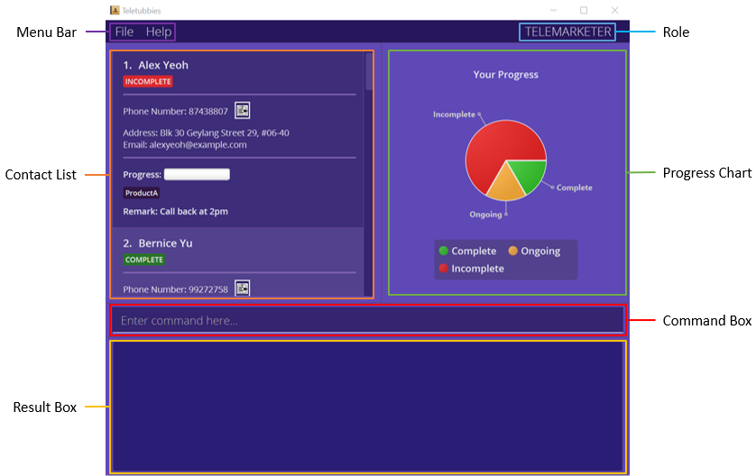

The UI has been designed primarily to be navigated using the command line interface. Users can enter commands into the
command box and press ENTER to execute them. The result box will be updated with information on whether the command has
been successfully executed, and if not, it will display an appropriate error message. Depending on the command executed,
the main panel may also be updated based on the command executed.

When entering a command, you may find it helpful to see a history of your previous commands. To do so, you can simply
[press UP or DOWN](#convenience-features) while typing to navigate through the command history list, or alternatively, you can use the
[history command](#listing-your-previous-commands-history).

[⏫ Back to content page](#table-of-contents)

<div style="page-break-after: always;"></div>

#### 2.3.3. Command Flags

Commands in Teletubbies are constructed using a **command word**. Each command can take in multiple **flags** and
**parameters** in succession. In general, the format is:

**[Command word] [[Flag] [Parameter]]…​**

If this sounds complicated, let's take a look at at an example:

`add -n John Doe -p 91827364`

In this example, the **command word** is `add`, the **flags** are `-n` and `-p`, and the **parameters** are `John Doe`
and `91827364`. Here, each **parameter** corresponds to each **flag** to form a pair. Each of these pairs are
specified in succession after the **command word**! 

<div markdown="block" class="alert alert-info">

**:information_source: Note:**<br>

The order of the **flag**-**parameter** pairs do not matter. For instance, `add -n John Doe -p 91827364` and `add -p
91827364 -n John Doe` will be treated as the same command.
</div>

Below is the list of available flags and their meanings:

* `-n`: Name
* `-p`: Phone number
* `-a`: Address
* `-e`: Email Address
* `-i`: Index
* `-t`: Tag
* `-v`: Value
* `-r`: Remark
* `-role`: Role

Additionally, there are special flags that are feature-specific and **do not require any parameters**:

* `-s`: Supervisor
* `-ong`: Ongoing
* `-inc`: Incomplete

<div markdown="block" class="alert alert-warning">

**:exclamation: Important:**<br>

If you are a new user, this list may be confusing. Hence, we recommend that you read through the subsections under the
[Features section](#4-features) that are dedicated to each feature. These subsections will use comprehensive examples to
clearly outline which of these flags correspond to each of the commands, and will explain how to use them, as well as
what **parameters** they take in (or if they take in **parameters** at all).
</div>

[⏫ Back to content page](#table-of-contents)

<div style="page-break-after: always;"></div>

#### 2.3.4. Command Format

Commands that are discussed in this User Guide follow these specifications:

* Words in `UPPER_CASE` are the parameters to be supplied by the user.<br>
  e.g. in `add -n NAME`, `NAME` is a parameter which can be used as `add -n John Doe`.

* Items in square brackets are optional.<br>
  e.g. `-n NAME [-t TAG]` can be used as `-n John Doe -t friend` or as `-n John Doe`.

* Items with `…`​ after them can be used multiple times, or even left blank.<br>
  e.g. `[-t TAG]…​` can be used as ` ` (i.e. 0 times), `-t friend`, `-t friend -t family` etc.

* Parameters can be in any order.<br>
  e.g. if the command specifies `-n NAME -p PHONE_NUMBER`, `-p PHONE_NUMBER -n NAME` is also acceptable.

In addition, when entering the commands into the command box, the application will interpret the commands following
these specifications:

* If a parameter is expected only once in the command but you specified it multiple times, only the last occurrence of
  the parameter will be taken.<br>
  e.g. if you type in `-p 12341234 -p 56785678`, only `-p 56785678` will be considered.

* Extraneous parameters for commands that do not take in parameters (such as `help`, `list`, `exit` and `clear`) will be
  ignored.<br>
  e.g. if you type in `help 123`, it will be interpreted as `help`.

<div markdown="block" class="alert alert-info">

**:bulb: Tip:**<br>

* Parameters refer to information that is to be included as an input to a command.
</div>

[⏫ Back to content page](#table-of-contents)

--------------------------------------------------------------------------------------------------------------------

<div style="page-break-after: always;"></div>

## **3. Quick Start**

1. Ensure you have Java `11` or above installed on your Computer. If not, you can install it from
[here](https://www.oracle.com/sg/java/technologies/javase/jdk11-archive-downloads.html). Please ensure to download the
correct version based on your operating system (e.g. Windows / macOS / Linux) and follow the Java installation
instructions. For more information on how to install Java `11`, please refer to
[this article](https://www.codejava.net/java-se/download-and-install-java-11-openjdk-and-oracle-jdk).


2. Download the latest `teletubbies.jar` from [here](https://github.com/AY2122S1-CS2103T-W15-4/tp/releases).


3. Copy the file to the folder you want to use as the *home folder* for your Teletubbies app. For beginners, you can
simply create a folder on your desktop and move the downloaded `teletubbies.jar` into the folder.


4. Double-click the file to start the app. A GUI similar to below should appear in a few seconds.
Note that when you start the app for the first time, the app should contain some sample data.


   


5. Try typing the following commands in the command box and press Enter to execute it.
    > E.g. typing **`help`** and pressing Enter will open the help window.<br>

    Some example commands you can try:

    * `list`: Lists all contacts.
    * `add -n Mark Tan -p 87654321`: Adds a contact named `Mark Tan` to Teletubbies, with the phone number 87654321.
    * `delete -i 2`: Deletes the contact named `Jennifer Liew`, which is the 2nd contact shown in the list on the previous page.
    * `done 1`: Marks the contact named `John Doe` as done, which is the 1st contact shown in the list on the previous page.
    * `clear`: Deletes all contacts.
    * `exit`: Exits the app.

6. You're all set! Please refer to the [Features](#4-features) section for details on each command.

[⏫ Back to content page](#table-of-contents)

--------------------------------------------------------------------------------------------------------------------

<div style="page-break-after: always;"></div>

## **4. Features**

Features and corresponding commands have been categorised into:

1. [System commands](#41-system-commands)
2. [Contact commands](#42-contact-commands)
3. [List commands](#43-list-commands)
4. [Other features](#44-other-features)

### 4.1. System commands

These commands are related to the Teletubbies application as a whole. The commands available are:
* [`help`](#viewing-help-help)
* [`profile`](#setting-your-profile-profile)
* [`import`](#importing-contacts-import)
* [`merge`](#merging-contacts-merge)
* [`export`](#exporting-contacts-export)
* [`history`](#listing-your-previous-commands-history)
* [`undo`](#undoing-your-previous-commands-undo)
* [`redo`](#redoing-your-previous-commands-redo)
* [`clear`](#clearing-all-entries-clear)
* [`exit`](#exiting-the-program-exit)

[⏫ Back to content page](#table-of-contents)

<div style="page-break-after: always;"></div>

#### Viewing help: `help`

Upon entering the `help` command, another window pops up with our comprehensive User Guide (as shown below) which you
can read by scrolling up and down! This command is especially useful for when you've forgotten the
format of a particular command, or if you're unsure what commands are available at your disposal.

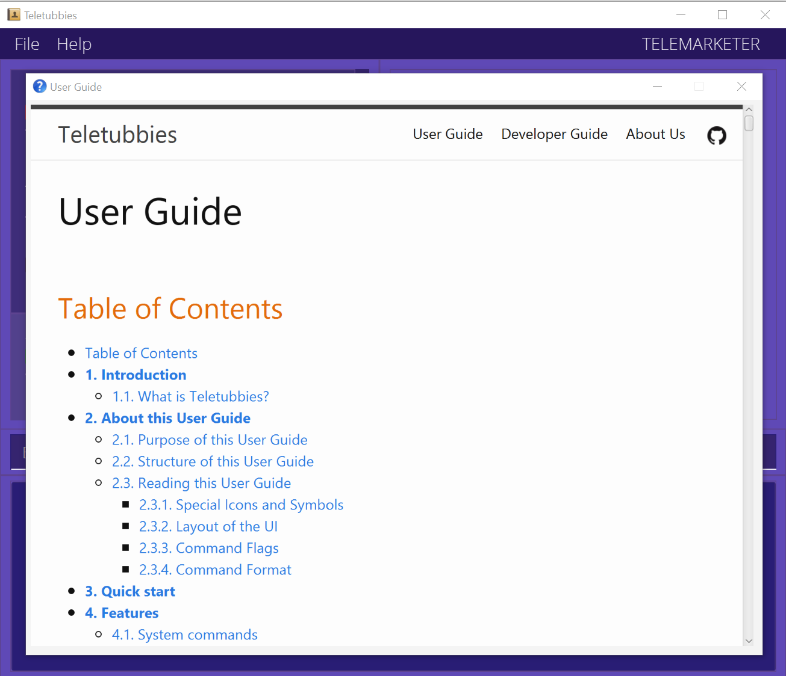

Format: `help`

[⏫ Back to content page](#table-of-contents)

<div style="page-break-after: always;"></div>

#### Setting your profile: `profile`

The `profile` command will help you to set your user profile for Teletubbies.

In Teletubbies, your user profile consists of your **name** and **role**.

Your **name** should be the name that you use in the workplace, so that
you can be identifiable by your co-workers and supervisors.

Your **role** should be according to your job scope:

* If your job is a telemarketing job, and you want to be able to view your customers
  in an organised list and keep track of your progress, then your role is `Telemarketer`.
* If your job involves keeping track of progress for telemarketers under you, then
  your role is `Supervisor`.

The reason we specify your **role** is so that Teletubbies can better accommodate your needs
by providing you with the suitable features tailored to your needs.

Once you set your profile up with the `profile` command, you should be good to go!

Format: `profile -n NAME -role ROLE`

Examples:
* `profile -n David Wong -role Telemarketer`
> This command will set your name as "David Wong" and your role as "Telemarketer".
* `profile -n -role Telemarketer`
> This command will set your role as "Telemarketer".

<div style="page-break-after: always;"></div>

* `profile -n Anne Goh -role Supervisor`
> This command will set your name as "Anne Goh" and your role as "Supervisor".
> 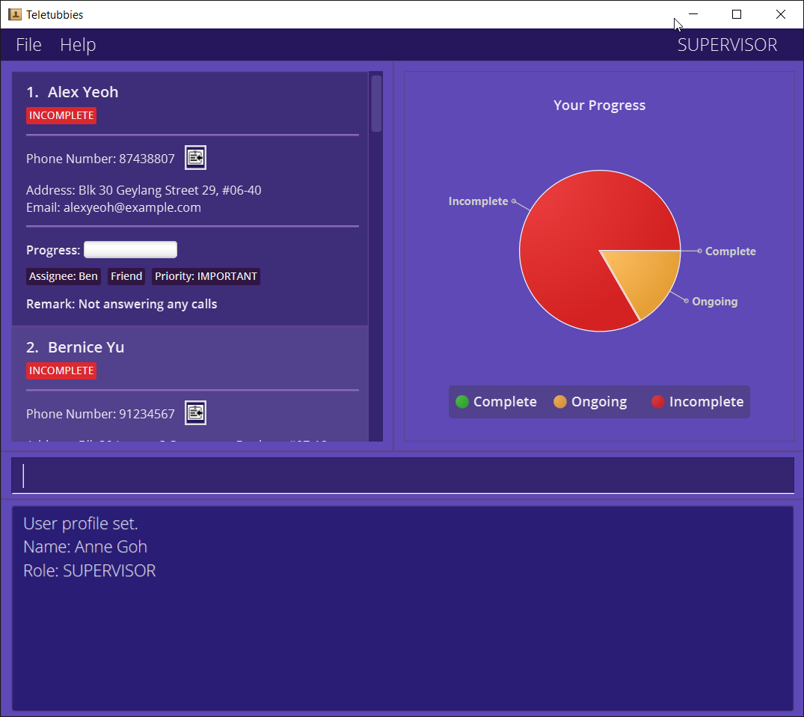

<div markdown="block" class="alert alert-info">

**:information_source: Note:**<br>

Teletubbies provides the option for users to leave their names as empty, but it is highly recommended for you to set your
name for identification purposes.

Additionally, the `profile` command can only be used to set up your user profile once. To modify your name or role, please
follow the steps [here](#5-faq).

</div>

<div markdown="block" class="alert alert-warning">

**:exclamation: Important:**<br>

If you are opening Teletubbies for the first time, you should be sure to set your profile before doing any actions. 
</div>

[⏫ Back to content page](#table-of-contents)

<div style="page-break-after: always;"></div>

#### Importing contacts: `import`

The `import` command will help you to import a set of customer contact data into the application. If you are a 
telemarketer you will likely use this command frequently to load customer contact lists from your supervisor.

You can issue this command by either typing it into the CLI (`import`), or going to the menu bar at the top and
selecting `File -> Import`. Once the command is issued, Teletubbies will open a file selector window as shown below.

**Before Import:**

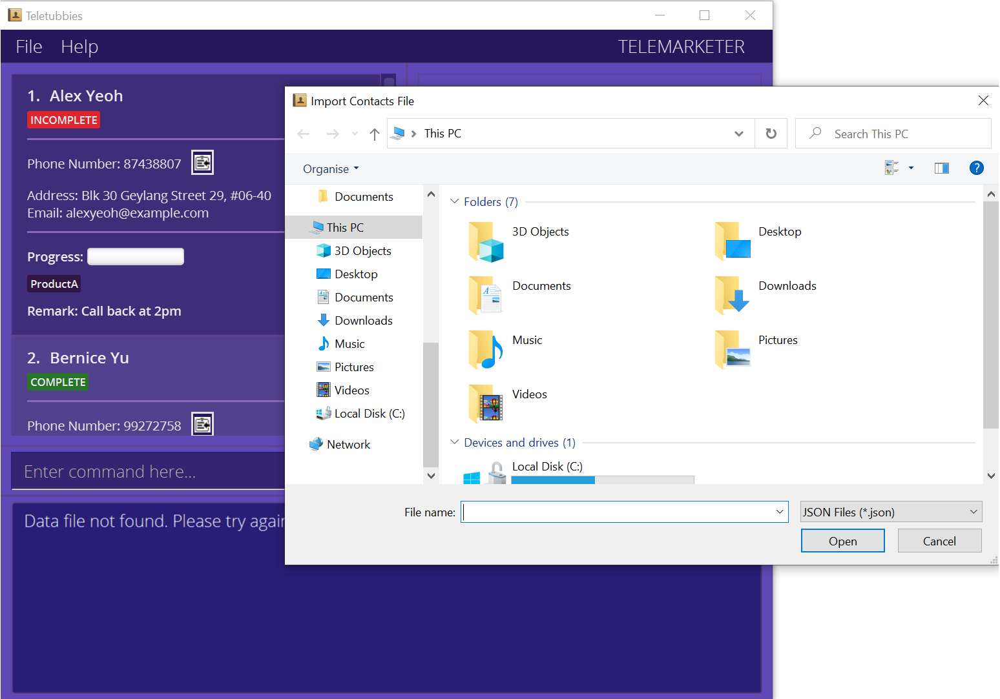

<div style="page-break-after: always;"></div>

**After Import:**

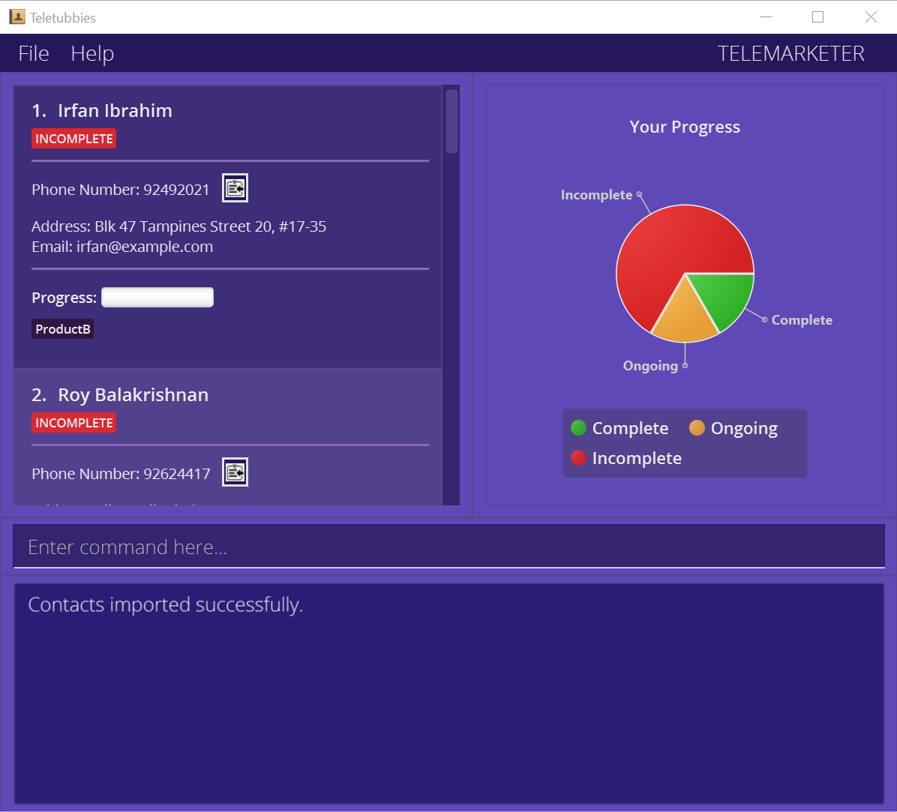

The data to be imported must be a JSON file, with the file extension `.json`.

Format: `import`

<div markdown="span" class="alert alert-warning">:exclamation: **Caution:**
* If the format of the selected data file is invalid, Teletubbies will start with an empty contact list!
* `import` will cause all our current contacts to be wiped from Teletubbies! If you wish to keep
your current contacts too, check out [merge](#merging-contacts-merge)!
</div>

[⏫ Back to content page](#table-of-contents)

<div style="page-break-after: always;"></div>

#### Merging contacts: `merge`

The `merge` command is a special kind of importing, and it will help you to merge a set of customer contact data
with the current data inside the application. If you are supervisor, you will likely use this command frequently to
update your contact list with the latest versions of your employees' contact lists.

You can issue this command by either typing it into the CLI (`merge`), or going to the menu bar at the top and
selecting `File -> Merge`. Once the command is issued, Teletubbies will open a file selector window as shown below.

**Before Merge:**

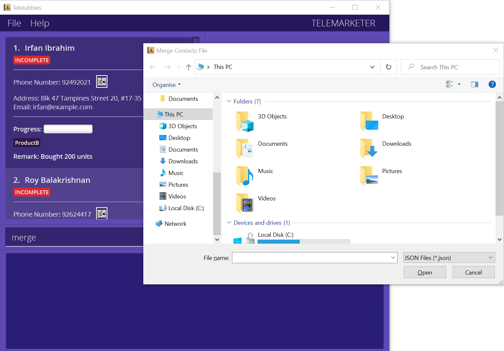

<div style="page-break-after: always;"></div>

**After Merge:**

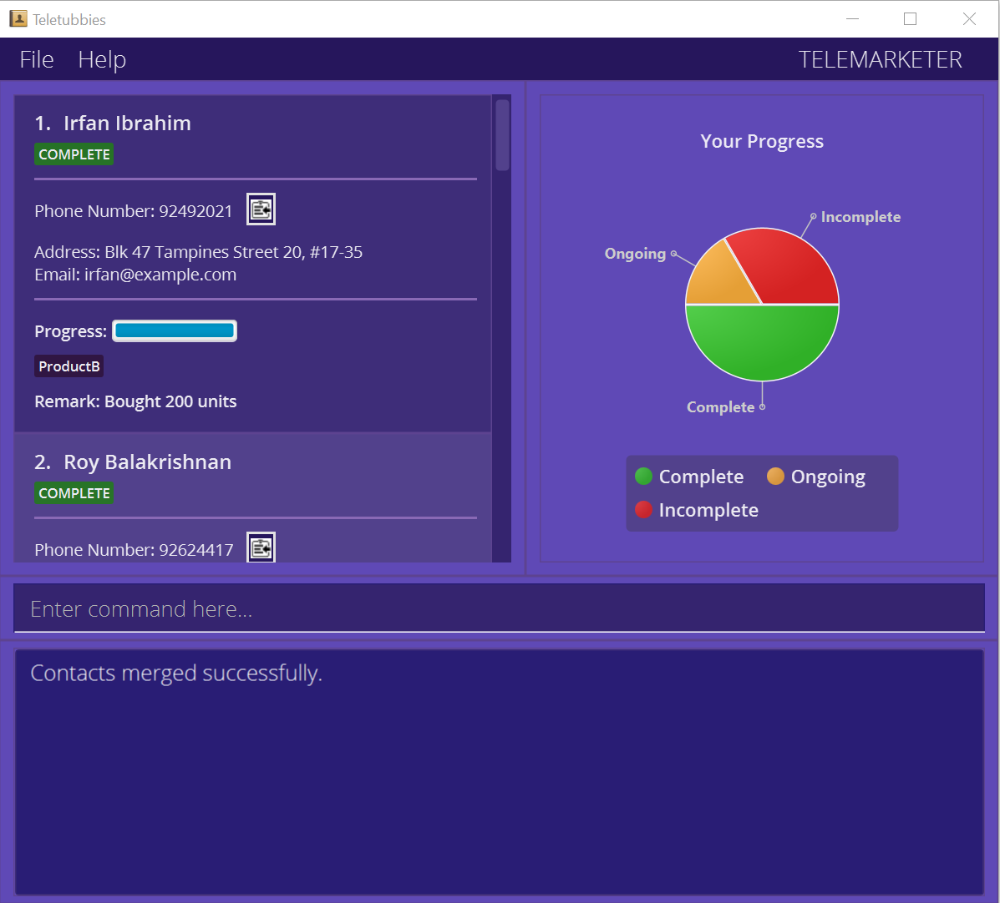

The data to be imported and merged must be a JSON file, with the file extension `.json`.

Format: `merge`

<div markdown="span" class="alert alert-warning">:exclamation: **Caution:**
This command should only be used if you are sure that you want to combine the new data to be imported with
the current data in the application. The new data will overwrite the current data, so be careful!
</div>

[⏫ Back to content page](#table-of-contents)

<div style="page-break-after: always;"></div>

#### Exporting contacts: `export`

The `export` command will help you to export selected customer contact data in the application. If you are a
supervisor, you will find this command especially useful when you want to generate contact lists for your employees.
If you are a telemarketer, you will also find this command useful for sending your updated contact lists back to your
supervisor.

You can issue this command by either typing it into the CLI (`export`), or going to the menu bar at the top and
selecting `File -> Export`. Note that there is a crucial difference here:

* If you choose to type it into the CLI (`export`), you will be able to specify which contacts you want
  to export, based on the tags.
* If you select `File -> Export` through the GUI, Teletubbies will automatically export ALL contacts, regardless of
  tags.

Once the command is issued, Teletubbies will ask you to confirm the export, as shown below.

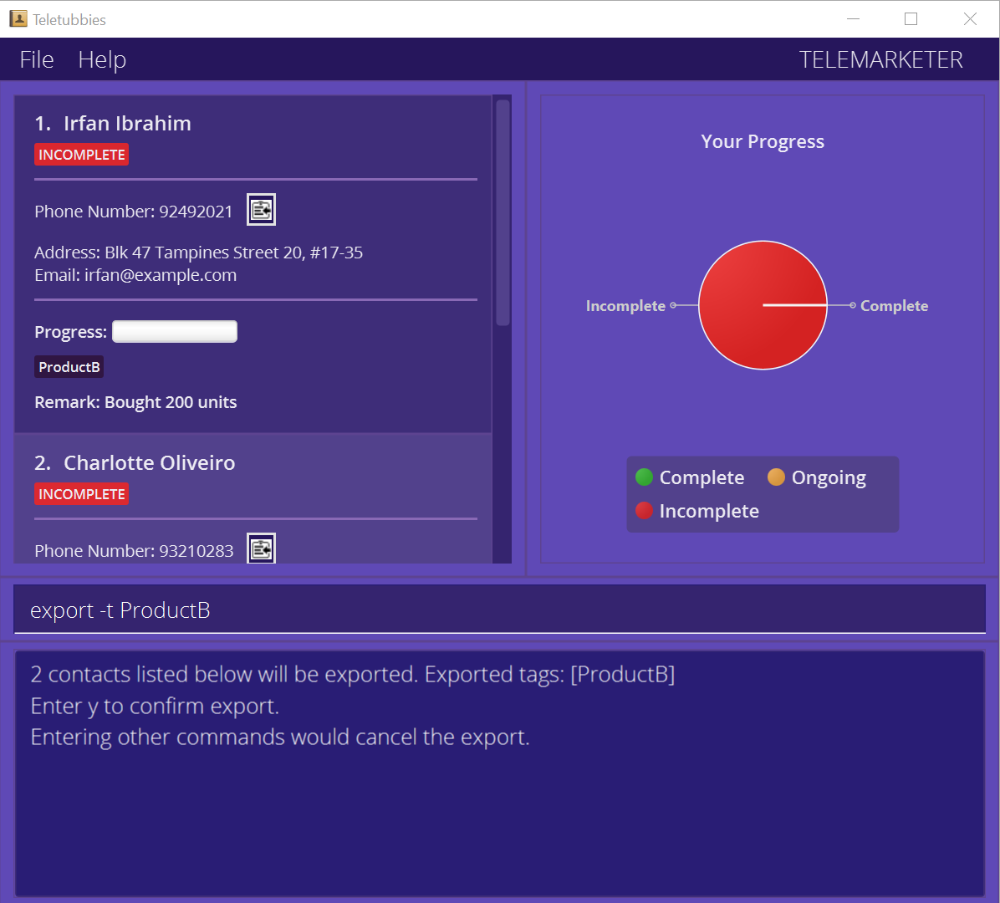

Type `y` to confirm the export. If you decide to cancel the export, you can type in any other command. Teletubbies will automatically cancel the export
for you as long as the next command received is NOT `y`.

After export has been confirmed, Teletubbies will open a file selector window as shown below. 

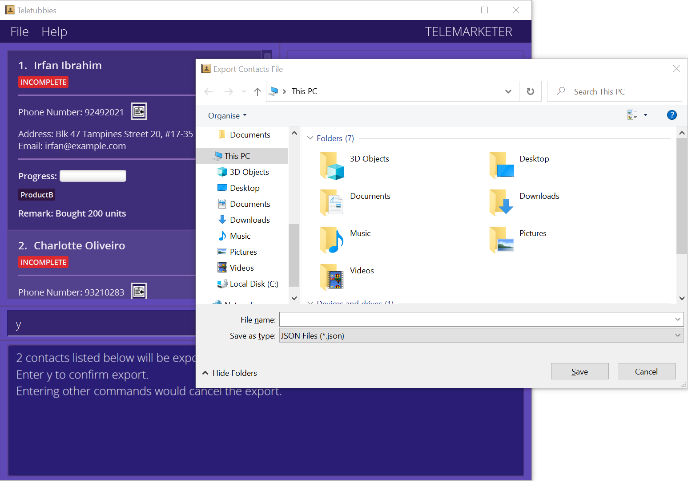

Using the file selector, you can choose where the exported file will be saved and name the file. We highly recommend
that you export the file as a JSON file, with the file extension `.json`.

Format: `export [-t TAGS]…​`

Examples:
* `export`
> This command will export all contacts.
* `export -t friends`
> This command will export all contacts containing the "friends" tag.
* `export -t friends -t family`
> This command will export all contacts containing BOTH the "friends" tag, and the "family" tag.

<div markdown="span" class="alert alert-warning">:bulb: Tip: You can use the filtered list displayed on Teletubbies to
double-check if the contacts you want to export are accurate, saving you precious time with Teletubbies’ easy-to-read
interface! 
</div>

[⏫ Back to content page](#table-of-contents)

#### Listing your previous commands: `history`

The `history` command will help you to view all the commands that have been issued by you in the **current session**. You
can use this command to retrieve and keep a record of previously used commands.

The commands will be displayed in order from the most recently issued command to the earliest issued command.

Format: `history`

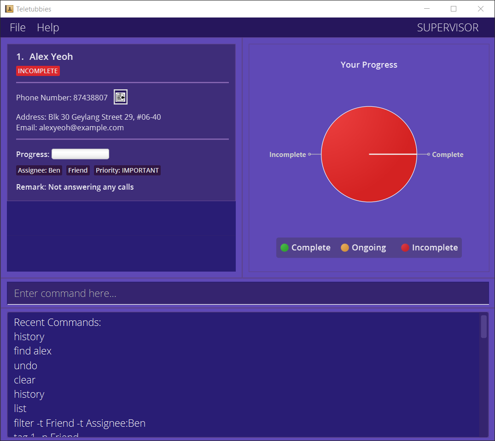

<div markdown="block" class="alert alert-info">

**:information_source: Commands that will be displayed:**<br>

The **current session** refers to the duration from the time you start up Teletubbies to the time
you close or exit Teletubbies. Once you close or exit Teletubbies, your session will end, and the command history
will be reset. The next time you start up Teletubbies, you will not be able to access the command history from your
previous session.
</div>
<div style="page-break-after: always;"></div>

#### Undoing your previous commands: `undo`

The `undo` command will help you to undo any changes you have made with your previous command.

Suppose that you entered a command, but realised that you made a mistake! Well, you can simply issue the
`undo` command to undo your mistake.

If there are no commands that have previously been issued in the current session, Teletubbies will let you know.
Otherwise, any changes you may have made with your previous command will be undone, so be careful when using this
command!

Format: `undo`

<div markdown="block" class="alert alert-info">

**:information_source: Note:**<br>

The following commands cannot be undone since they don't affect contact information:
* `export`
* `filter`
* `find`
* `help`
* `history`
* `list`
* `profile`

</div>

<div markdown="block" class="alert alert-info">

**:information_source: Retrieving previous versions:**<br>

Like [`history`](#listing-your-previous-commands-history), you can only retrieve changes made within your **current
session**. That is, once you close or exit Teletubbies and close your current session, you will not be able to retrieve
the previous versions of Teletubbies.
</div>

[⏫ Back to content page](#table-of-contents)

<div style="page-break-after: always;"></div>

#### Redoing your previous commands: `redo`

The `redo` command will help you to redo any `undo` command you have issued previously.

Suppose that you thought you made a mistake, so you issued an `undo` command, only to realise later that
it was actually the correct command! Well, you can simply issue the `redo` command to "undo" your `undo`, or
simply put, redo a command that you thought was a mistake.

If there are no commands that have previously been issued in the current session, Teletubbies will let you know.
Otherwise, any changes you may have made with your previous `undo` command will be undone, so be careful when using this
command!

Format: `redo`

[⏫ Back to content page](#table-of-contents)

<div style="page-break-after: always;"></div>

#### Clearing all entries: `clear`

The `clear` command will help you clear all contacts from the Teletubbies application.

Format: `clear`

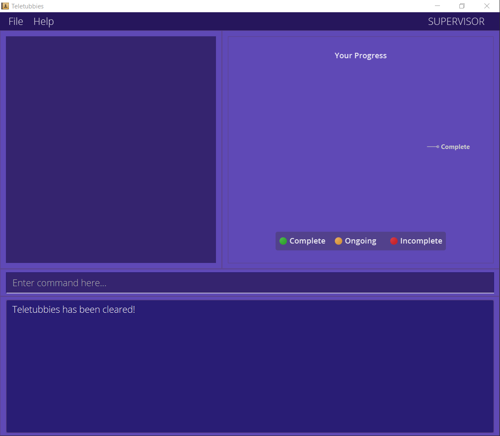

<div markdown="span" class="alert alert-warning">:exclamation: Caution:
Do NOT issue this command unless you are absolutely sure that you want to clear the list.
</div>

[⏫ Back to content page](#table-of-contents)

#### Exiting the program: `exit`

The `exit` command will help you gracefully exit Teletubbies.

Format: `exit`

<div style="page-break-after: always;"></div>

### 4.2. Contact commands

These commands are related to the contacts stored in Teletubbies. The commands available are:
* [`add`](#adding-a-contact-add)
* [`delete`](#deleting-a-contact-delete)
* [`edit`](#editing-a-contact-edit)
* [`done`](#marking-a-contact-as-completed-done)
* [`tag`](#tagging-contacts-tag)
* [`tagrm`](#removing-tags-from-contacts-tagrm)
* [`remark`](#adding-a-remark-to-a-contact-remark)

[⏫ Back to content page](#table-of-contents)

#### Finding the index

When dealing with contacts in Teletubbies, you will often have to use something called the **index**
of the contact.

To find out what the contact's index is, use the [List](#listing-all-contacts-list) feature to
find what number the contact is associated with in the contact list.

The index will always be a positive integer, i.e. 1, 2, 3, 4, ...

[⏫ Back to content page](#table-of-contents)

#### Copying phone numbers

We understand that as telemarketers, you may be using a desktop application to call a customer instead of using
your phone.

Hence, Teletubbies tries to help out in this area as well! Next to the phone number in each contact, there is a small
clipboard icon that looks like this: 

When you click on the icon, it will copy the phone number to your clipboard, so that you can paste it onto
your desktop calling app!

[⏫ Back to content page](#table-of-contents)

<div style="page-break-after: always;"></div>

#### Adding a contact: `add`

The `add` command will help you to add a contact to Teletubbies. Once added,
you should be able to view their contact details on the contact list.

Note that the contact's **name** and **phone number** are mandatory. Otherwise, Teletubbies
(and you) will find it difficult to identify the contact!

You can also indicate the **address** and
**email address** of a contact, both of which are optional fields.

Format: `add -n NAME -p PHONE_NUMBER [-a ADDRESS] [-e EMAIL]`

Examples:
* `add -n Betsy Crowe -p 12345678`
> This command will add the contact details for "Betsy Crowe", with their phone number as "12345678".
* `add -n John Snoe -p 98765432 -a Wall Street, Block 234, #08-06 -e johns@example.com`
> In the example below, "John Snoe" has been added to Teletubbies with their phone number as "98765432", 
> address as "Wall Street, Block 234, #08-06", and their email address as "johns@example.com".
> 

[⏫ Back to content page](#table-of-contents)

<div style="page-break-after: always;"></div>

#### Deleting a contact: `delete`

The `delete` command will help you to delete a customer's contact details from Teletubbies. Once
the contact has been deleted, you should no longer see their contact details on the contact list.

You can choose to delete the contact using either the index, or the phone number. When deleting the contact using the
phone number, make sure that the specified
phone number is associated with a contact in the contact list.

<div markdown="block" class="alert alert-info">

**:bulb: Tip:** If you don't know what the index is, refer to [Finding the index](#finding-the-index)!

</div>

Format: `delete -p PHONE_NUMBER` or `delete -i INDEX`

Examples:
* `delete -i 1`
> This command will delete the contact details for the contact with the index 1.
* `delete -p 98765432`
> This command will delete the contact details for the contact with the phone number "98765432". In the example below, John Snoe has been deleted.
> 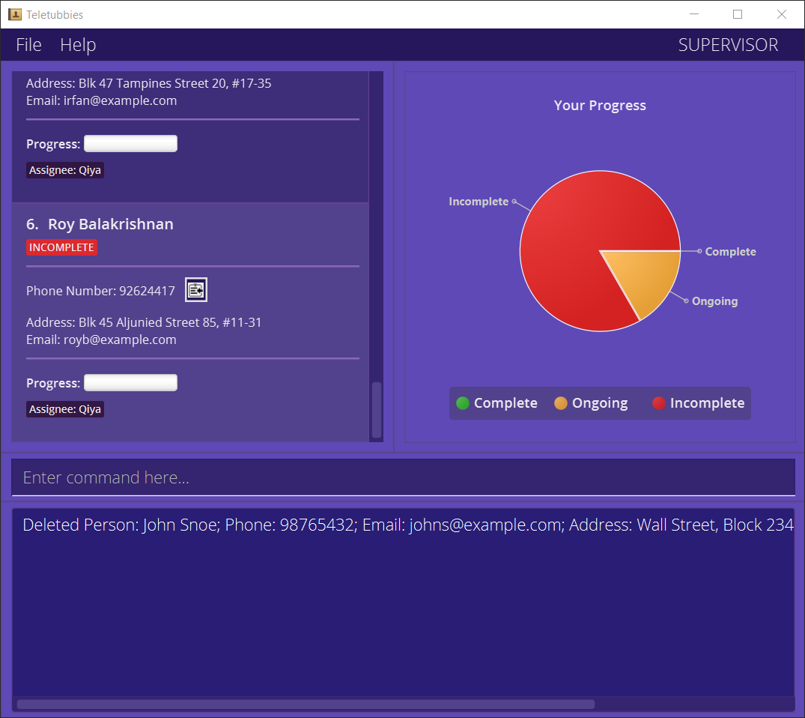

[⏫ Back to content page](#table-of-contents)

<div style="page-break-after: always;"></div>

#### Editing a contact: `edit`

The `edit` command will help you to edit a customer's contact details in Teletubbies. Note that
you can only edit the details for a contact that is already in Teletubbies' contact list.

You can choose which contact to edit by using the contact's index. If you don't know what the index is, refer to
[Finding the index](#finding-the-index).

When editing the contact, you can change the following fields: the **name**,
the **phone number**, the **address**, and the **email address** of the customer.

Each field is treated as
separate, and all four fields are optional, meaning that you can choose to edit only one or two out of the four fields.
However, at least one field should be provided (otherwise, you won't be editing anything).

Format: `edit INDEX [-n NAME] [-p PHONE] [-e EMAIL] [-a ADDRESS]`

Examples:
* `edit 1 -n Betsy Crower`
> This command will edit the name of the first person in the list to be "Betsy Crower".

<div style="page-break-after: always;"></div>

* `edit 2 -p 91234567 -e johndoe@example.com`
> In the example below, Bernice Yu's phone number has been edited to be "91234567", and the email address to be
> "johndoe@example.com".
> 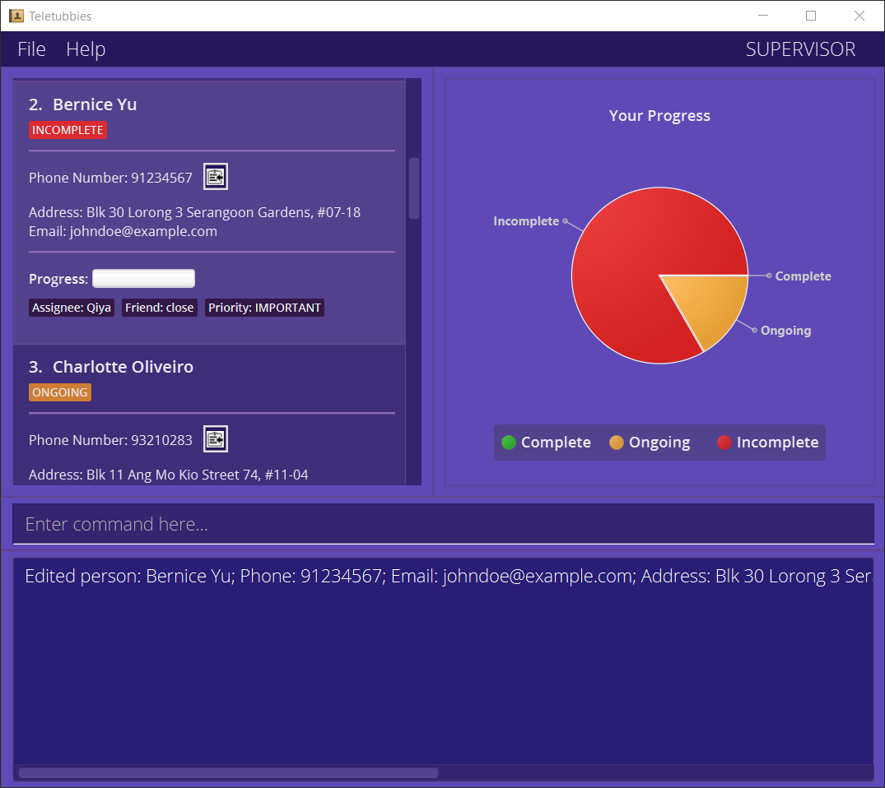

[⏫ Back to content page](#table-of-contents)

<div style="page-break-after: always;"></div>

#### Marking a contact as completed: `done`

The `done` command will help you to mark a contact's completion status in Teletubbies. Here, when we say "completion
status", we will leave it up to your company to decide exactly what each of the levels of completion status mean.

Regardless, Teletubbies provide three different levels of completion status: **Incomplete**, **Ongoing**, and
**Complete**. Take note that a contact can only be marked with at most one out of the three. You can't have a contact be
complete and ongoing at the same time! **The status is indicated in each of the contact details using a tag and a
progress bar.**

You can mark a contact with any of the three levels using the **index** of the contact. If you don't know what the index
is, refer to [Finding the index](#finding-the-index).

You will also be able to see the total level of completion status for a list of customers using the "Your Progress" tab,
which displays the information using a chart. Refer to [Progress Chart](#progress-chart) for more details.

Format: `done INDEX [STATUS]`

Examples:
* `done 1`
> This command will mark the first contact in the list as "Complete".
* `done 2 -inc`
> This command will mark the second contact in the list as "Incomplete".

<div style="page-break-after: always;"></div>

* `done 3 -ong`
> In the example below, Charlotte has been marked as "Ongoing".
> 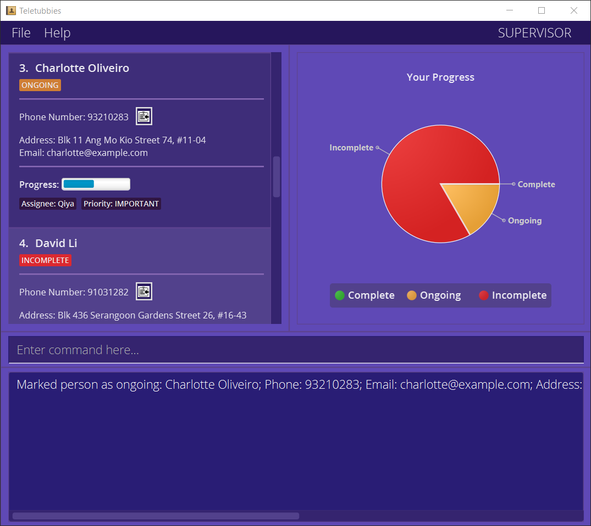

[⏫ Back to content page](#table-of-contents)

<div style="page-break-after: always;"></div>

#### Tagging contacts: `tag`

The `tag` command will help you to **tag** certain contacts with a tag of your choice. In Teletubbies,
our tags are very flexible: They can be single words, or a category. So for example, you can tag a contact
with "friend", or tag a contact with the category "status: not answering", etc. It's up to you!

Do note that there is a special category of tag, which is the **completion status**.
This tag cannot be added, edited or removed by the `tag` command or the `tagrm` command, and is only changeable using
the `done` command. Please refer to [Marking a contact as completed](#marking-a-contact-as-completed-done).

When tagging a contact, you can specify the **name** and **value** of the tag. The **name** is mandatory, but
the **value** is optional. To specify which contact to be tagged, use the index of the contact.
If you don't know what the index is, refer to [Finding the index](#finding-the-index).

Take note that contacts cannot have tags with duplicate names. So, if you have a contact that is already tagged,
and you decide to tag it again with the same **name** but different **value**, the new **value** will replace the old
one! For example, if a contact tagged with `Friend: good`, and is then tagged using another tag with the **name**
"Friend" and the **value** "close", the pre-existing tag will be updated from `Friend: good` to `Friend: close`.

Finally, there is an additional parameter that is only available to supervisors. When you add a `-s` at the end
of your tagging command, it will make sure that only supervisors are able to edit or remove that tag!

Format:`tag INDEX -n TAGNAME [-v VALUE] [-s]`

Examples:

* `tag 1 -n Friend`
> This command will tag the first contact in the list with the tag `Friend`.
* `tag 4 -n Assignee -v Mel -s`
> This command will tag the fourth contact in the list with the tag `Assignee: Mel`. Because of the `-s`, this tag will
> only be editable / removable by users whose roles are set as "Supervisor" For more information on roles, refer to
> [Setting your profile](#setting-your-profile-profile).

<div style="page-break-after: always;"></div>

* `tag 2 -n Friend -v close`
> In the example below, Bernice has been given the tag `Friend: close`.
> 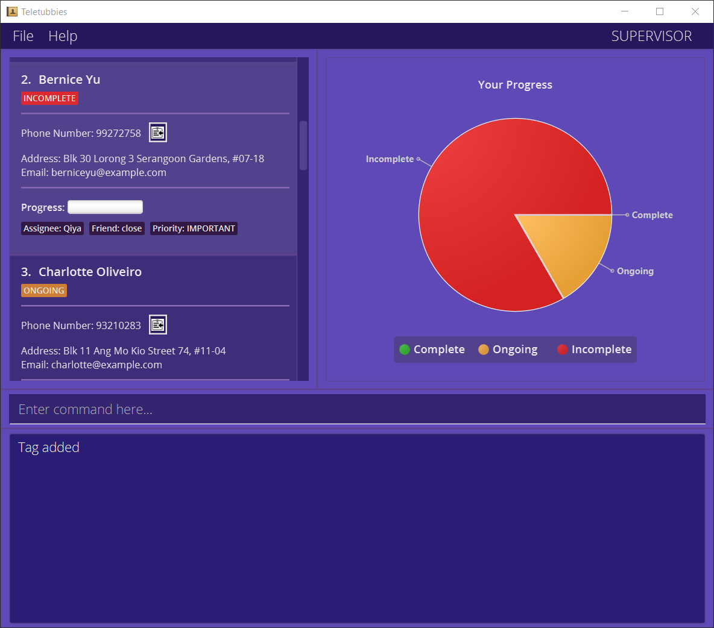

[⏫ Back to content page](#table-of-contents)

<div style="page-break-after: always;"></div>

#### Removing tags from contacts: `tagrm`

The `tagrm` command will help you to **remove** a tag from a contact. Note that the tag to be removed
must already be a tag on the contact, otherwise no tags will be removed!

When removing a tag from a contact, you can specify the **name** and **value** of the tag. Similar to the `tag` command,
the **name** is mandatory, but the **value** is optional. To specify which contact to be tagged, use the index of the
contact. If you don't know what the index is, refer to [Finding the index](#finding-the-index).

Note that tag name and tag value are case-sensitive. So, a command specifying tag name 'assignee' and tag value 'john'
will not remove the tag `Assignee:John` or `Assignee:john`.

Also, if the tag was created using the `-s` parameter, only supervisors will be able to remove the tag.

Format:`tagrm INDEX -n TAGNAME [-v VALUE]`

Examples:

* `tagrm 1 -n Friend -v close`
> This command will remove the tag `Friend: close` from the first contact in the list.

<div style="page-break-after: always;"></div>

* `tagrm 2 -n Friend`
> In the example below, Bernice has the tag `Friend: close` removed :(
> 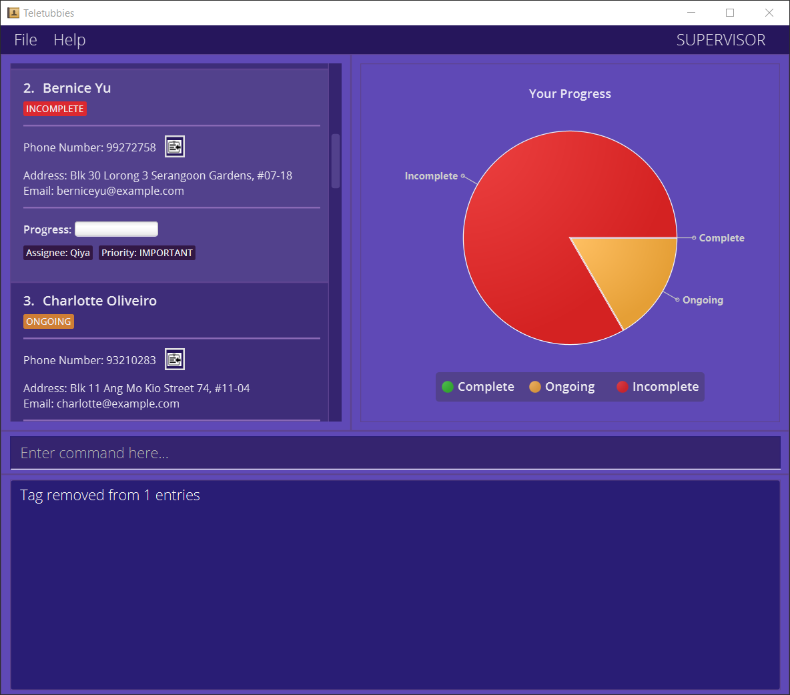

[⏫ Back to content page](#table-of-contents)

<div style="page-break-after: always;"></div>

#### Tagging and Removing tags from multiple contacts

Sometimes, you may need to assign the same tag to more than just one contact, or remove the same tag from more than just
one contact.

You can use the `tag` and the `tagrm` commands to do so! Just specify a **range of numbers** as the index rather than a
single number.

Format (`tag`): `tag INDEX [,INDEX]…​ -n TAGNAME [-v VALUE] [-s]`

Format (`tagrm`): `tagrm INDEX [,INDEX]…​ -n TAGNAME [-v VALUE]`

OR

Format (`tag`):`tag START-END -n TAGNAME [-v VALUE] [-s]`

Format (`tagrm`):`tagrm START-END -n TAGNAME [-v VALUE]`

Examples (`tag`):

* `tag 1,2,4 -n Friend -v close`
> This command will tag the first, second, and fourth contact in the list with the tag `Friend: close`.
* `tag 1-5 -n Friend -v close`
> This command will tag the first five contacts in the list, with the tag `Friend: close`.
* `tag 1-10 -n Assignee -v Mel -s`
> This command will tag the first ten contacts in the list with the tag `Assignee: Mel`. Because of the `-s`, this tag
> will only be editable / removable by users whose roles are set as "Supervisor" For more information on roles, refer to
> [Setting your profile](#setting-your-profile-profile).

Examples (`tagrm`):

* `tagrm 1,2,4 -n Friend`
> This command will remove the tag `Friend` from the first, second, and fourth contact in the list.
* `tagrm 1-5 -n Friend `
> This command will remove the tag `Friend` from the first five contacts in the list.

[⏫ Back to content page](#table-of-contents)

<div style="page-break-after: always;"></div>

#### Adding a remark to a contact: `remark`

The `remark` command will help you to add a remark to a chosen contact in the list. Remarks are a more general version
of the tags - the feature is for you to add extra information to a contact that you cannot add using tags. Note that a
remark cannot be longer than 40 letters!

To specify which contact to add a remark to, use the index of the contact. If you don't know what the index is,
refer to [Finding the index](#finding-the-index).

Format: `remark INDEX -r REMARK`

Examples:
* `remark 1 -r `
> This command will remove the existing remark from the first contact in the list.
* `remark 1 -r Not answering any calls`
> This command will add the remark `Not answering any calls` to the first contact in the list.
> 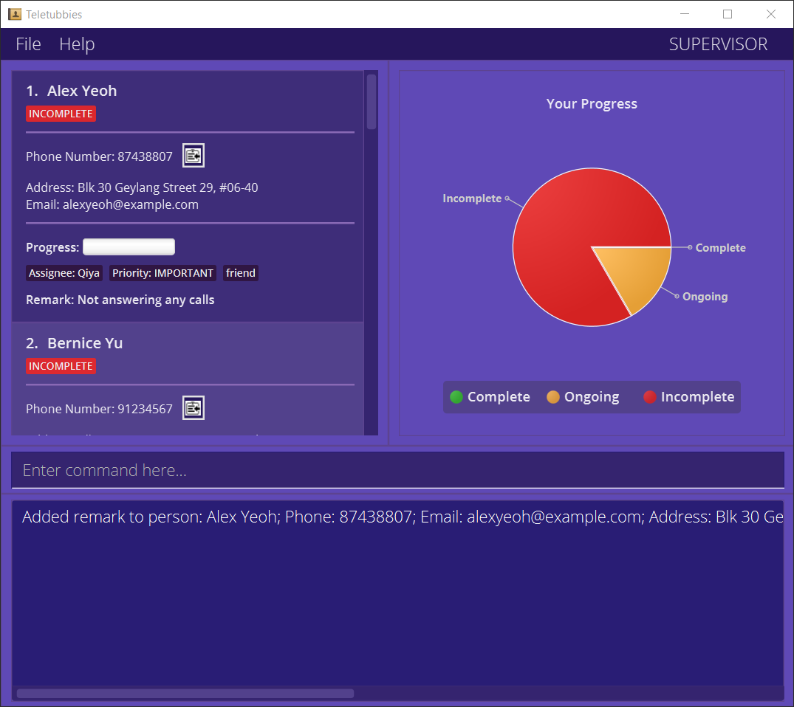


<div markdown="block" class="alert alert-info">

**:information_source: Only one remark allowed per contact**<br>

A contact can only have a maximum of **one** remark. If a contact already has a remark, any new remark added
will replace the existing remark.
</div>

[⏫ Back to content page](#table-of-contents)

<div style="page-break-after: always;"></div>

### 4.3. List commands

These commands are related to the contact list stored in Teletubbies. The commands available are:
* [`list`](#listing-all-contacts-list)
* [`find`](#locating-contacts-by-name-find)
* [`filter`](#filtering-contact-list-filter)

[⏫ Back to content page](#table-of-contents)

#### Listing all contacts: `list`

The `list` command will help you to view the entire contact list currently in Teletubbies.

By listing all contacts, you will be able to find the number associated with a specific contact that you want to interact
with. This number is known as the `index` of the contact.

Format: `list`

[⏫ Back to content page](#table-of-contents)

<div style="page-break-after: always;"></div>

#### Locating contacts by name: `find`

The `find` command will help you find relevant contacts whose **names** contain the given keyword(s), and will update the contact list to display the search results.

When Teletubbies searches the contacts using the given keyword(s), it will only look at the **names**
of the contacts, not the **phone numbers**, **addresses** or the **email addresses**.

The order of the keywords given does not matter, and any contact whose **name** contains any one of the  keywords will be returned.

Format: `find KEYWORD [KEYWORD]…​`

Examples:
* `find John`
> This command will return all contacts whose names contain "John", such as `John`, `john`, or `John Doe`. As mentioned
> below, it is case-insensitive.
* `find jo`
> This command will return all contacts whose names contain "jo", such as `John` or `Joe`.

<div style="page-break-after: always;"></div>

* `find alex david`
> This command will return all contacts whose names contain "alex" or "david" in no particular order, such as `Alex Yeoh`,
> `david li`, or `David alex`.
> 

<div markdown="block" class="alert alert-info">

**:information_source: Keywords are case-insensitive:**<br>

The search process is case-insensitive, meaning that if a keyword `hans` is given, a contact with the name `Hans` may
be returned.
</div>

[⏫ Back to content page](#table-of-contents)

<div style="page-break-after: always;"></div>

#### Filtering contact list: `filter`

The `filter` command will help you filter the current contact list using the given tag(s), and will change the contact
list display to show only the contacts that are tagged with the given tag(s). This command can help you focus on
specific contacts of interest (like contacts tagged as important) instead of scrolling through a long list of contacts.

When issuing the `filter` command, you should specify at least one **tag name**. Tag values are optional, but can help
to further narrow your filter if necessary.

<div markdown="block" class="alert alert-info">

**:information_source: Tag name and tag value are case-sensitive:**<br>

This means that the following tags are different:
- `assignee: john`
- `assignee: John`
- `Assignee: John`

</div>

Format: `filter -t TAGNAME[:TAGVALUE] [-t TAGNAME[:TAGVALUE]]…​ `

Examples:
* `filter -t Friend`
> This command will filter the displayed list to only users who have the tag `Friend`, regardless of tag value. This
> means that persons with the tags `Friend: Close`, AND `Friend: VeryClose` will both be listed.
* `filter -t Assignee:Ben`
> This command will filter the displayed list to only users who have the tag `Assignee: Ben`. Persons with the
> `Assignee: Sid` tag will NOT be listed.

<div style="page-break-after: always;"></div>

* `filter -t Friend -t Assignee:Ben`
> This command will filter the displayed list to only users who have the tag `Friend` AND `Assignee: Ben`. Contacts
> that have only one of the given tags will NOT be listed.
> 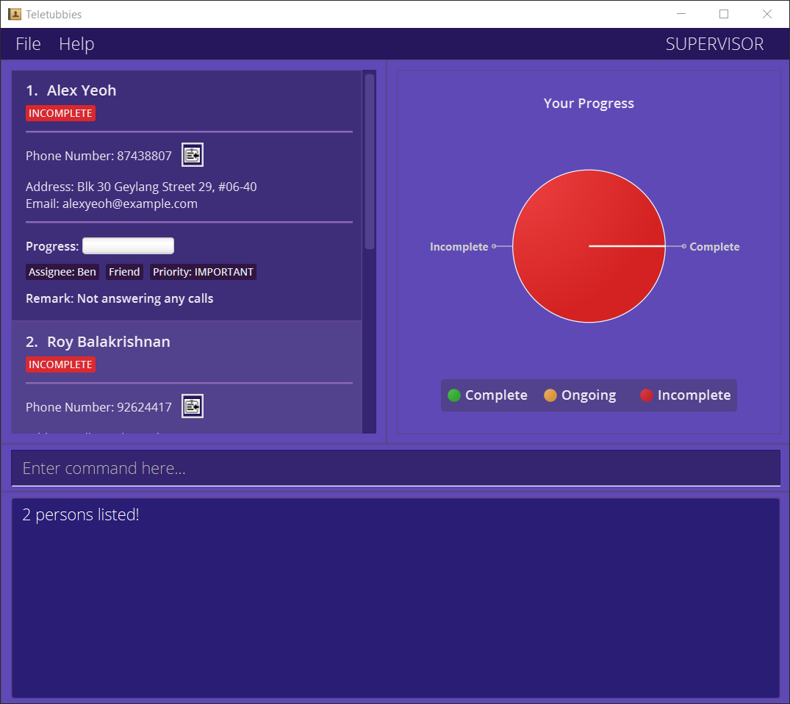

[⏫ Back to content page](#table-of-contents)

<div style="page-break-after: always;"></div>

### 4.4. Other features

#### Progress Chart

Since each contact has a completion status tied to it with the levels of completion status
`Complete`, `Ongoing`, or `Incomplete`, Teletubbies will automatically collate the data and
create a nice pie chart to display the aggregate completion status of the current list.

Whenever the list that you are viewing changes (usually when issuing [list commands](#43-list-commands)),
the chart will update automatically!

#### Convenience features

Sometimes, you may feel hard-pressed from typing these commands repeatedly. You can avoid this by trying out some
of our convenience features in Teletubbies. These include:
* Pressing the **[UP]** arrow button on your keyboard to retrieve a previously keyed-in command,

<div markdown="block" class="alert alert-info">:information_source: Tip:
You can only access the previous commands up to the first command keyed in after starting Teletubbies. Once the earliest
command is obtained, you will continue to see that command on the text input box.
</div>

* Pressing the **[DOWN]** arrow button on your keyboard to retrieve the command after the current command,

<div markdown="block" class="alert alert-info">:information_source: Tip:
Once the most recent command is obtained, you will continue to see that command on the text input box.
</div>

<div style="page-break-after: always;"></div>

* Pressing the **[TAB]** key after typing a command to automatically complete and suggest to you the required fields
needed for the command word.

<div markdown="block" class="alert alert-info">:information_source: Tip:
For instance, pressing the **[TAB]** key after typing `add` produces `add -n -p -e -a` on the text input box.

Here is an image of the command box before pressing the **[TAB]** key: 


And here is an image of the command box after pressing the **[TAB]** key:


It is important to note that pressing the **TAB** key will only work if the given word is a command word. For example,
if you type `ad` and then press the **TAB** key, the given text will remain.
</div>

<div style="page-break-after: always;"></div>

#### Saving the data

Teletubbies automatically saves the data in the hard disk after any command that changes the data. There is no need to
save manually.

For exporting the current data as a separate JSON file, refer to [Exporting contacts](#exporting-contacts-export).

#### Loading the data

Teletubbies will automatically load up the data from your previous session, allowing you to pick up right where you
left off. There is no need to load manually.

For importing a contact list in the JSON file format into the application, refer to
[Importing contacts](#importing-contacts-import).
For merging a contact list from your hard disk with the contact list on the application, refer to
[Merging contact lists](#merging-contacts-merge)

#### Editing the data

Teletubbies will save the data as a JSON file `[JAR file location]/data/teletubbies.json`. Advanced users are welcome
to update data directly by editing that data file.

<div markdown="span" class="alert alert-warning">:exclamation: Caution:
If your changes to the data file makes its format invalid, Teletubbies will discard all data and start with an empty
data file at the next run!
</div>

[⏫ Back to content page](#table-of-contents)

--------------------------------------------------------------------------------------------------------------------

<div style="page-break-after: always;"></div>

## **5. FAQ**

**Q**: How do I transfer my data to another Computer?<br>
1. Install the Teletubbies app in the other computer.
2. Use the [`export`](#exporting-contacts-export) command to export your contacts as a JSON file. Transfer the contacts
file to the other computer.
3. On the other computer, launch the Teletubbies app and use the [`import`](#importing-contacts-import) command to
import the contacts file that you transferred over.

**Q** How do I change my role after setting it once?<br>
1. In the same folder as `teletubbies.jar`, look for the `preferences.json` file.
2. In `preferences.json`, locate the `isProfileSet` field and set it to false as follows:

    ```
       {
        
         ...
        
         "userProfile" : {
           "name" : "",
           "role" : "SUPERVISOR"
         },
         "isProfileSet" : false, // set this field to false
        
         ...
                
       }
    ```

3. When you restart Teletubbies, you should be able to modify your role with the [profile](#setting-your-profile-profile)
command.

[⏫ Back to content page](#table-of-contents)

--------------------------------------------------------------------------------------------------------------------

<div style="page-break-after: always;"></div>

## **6. Command Summary**

These are all the available commands in Teletubbies.

To navigate to the section for each command, click on the hyperlinked commands in the left column.
The sections outline the detailed usage and examples for each of the command.

System commands | Format
--------|------------------
**[help](#viewing-help-help)** | `help`
**[profile](#setting-your-profile-profile)** | `profile -n NAME -role ROLE`
**[import](#importing-contacts-import)** | `import`
**[merge](#merging-contacts-merge)** | `merge`
**[export](#exporting-contacts-export)** | `export [-t TAGS]…​`
**[history](#listing-your-previous-commands-history)** | `history`
**[undo](#undoing-your-previous-commands-undo)** | `undo`
**[redo](#redoing-your-previous-commands-redo)** | `redo`
**[clear](#clearing-all-entries-clear)** | `clear`
**[exit](#exiting-the-program-exit)** | `exit`

Contact commands | Format
--------|------------------
**[add](#adding-a-contact-add)** | `add -n NAME -p PHONE_NUMBER [-a ADDRESS] [-e EMAIL]`
**[delete](#deleting-a-contact-delete)** | `delete -p PHONE_NUMBER` or `delete -i INDEX`
**[edit](#editing-a-contact-edit)** | `edit INDEX [-n NAME] [-p PHONE] [-e EMAIL] [-a ADDRESS]`
**[done](#marking-a-contact-as-completed-done)** | `done INDEX [STATUS]`
**[tag](#tagging-contacts-tag)** | `tag INDEX -n TAGNAME [-v VALUE] [-s]`
**[tagrm](#removing-tags-from-contacts-tagrm)** | `tagrm INDEX -n TAGNAME [-v VALUE]`
**[tag <br>(multiple contacts)](#tagging-and-removing-tags-from-multiple-contacts)** | `tag INDEX [,INDEX]…​ -n TAGNAME [-v VALUE] [-s]` <br> `tag START-END -n TAGNAME [-v VALUE] [-s]`
**[tagrm <br>(multiple contacts)](#tagging-and-removing-tags-from-multiple-contacts)** | `tagrm INDEX [,INDEX]…​ -n TAGNAME [-v VALUE]` <br> `tagrm START-END -n TAGNAME [-v VALUE]`
**[remark](#adding-a-remark-to-a-contact-remark)** | `remark INDEX -r REMARK`

List commands | Format
--------|------------------
**[list](#listing-all-contacts-list)** | `list`
**[find](#locating-contacts-by-name-find)** | `find KEYWORD [KEYWORD]…​`
**[filter](#filtering-contact-list-filter)** | `filter -t TAGNAME[:TAGVALUE] [-t TAGNAME[:TAGVALUE]]…​ `

[⏫ Back to content page](#table-of-contents)

--------------------------------------------------------------------------------------------------------------------

<div style="page-break-after: always;"></div>

## **7. Glossary**

This section serves to provide a summary of descriptions and definitions of terms used throughout this User Guide.
Familiarising yourself with this section will make the User Guide easier to read.

Term | Meaning
--------|------------------
**Java** | A runtime environment that allows applications such as Teletubbies to be run on your computer.
**JavaScript Object Notation (JSON)** | A text-based representation of structured data that is used to save contacts as files in Teletubbies.
**Command-line Interface (CLI)** | A user interface that allows users to interact with a system through text commands.
**Graphical User Interface (GUI)** | A user interface that allows users to interact with a system through graphical icons.
**Command** | An instruction typed by a user, to be executed by Teletubbies.
**Parameter** | Input to a command's field.

[⏫ Back to content page](#table-of-contents)

--------------------------------------------------------------------------------------------------------------------

<div style="page-break-after: always;"></div>

## **8. Acknowledgements**

This project is based on the AddressBook-Level3 project created by the [SE-EDU initiative](https://se-education.org/).

During the development process, we have used the following libraries: 
* [JavaFX](https://openjfx.io/)
* [JUnit5](https://github.com/junit-team/junit5)

[⏫ Back to content page](#table-of-contents)

--------------------------------------------------------------------------------------------------------------------
